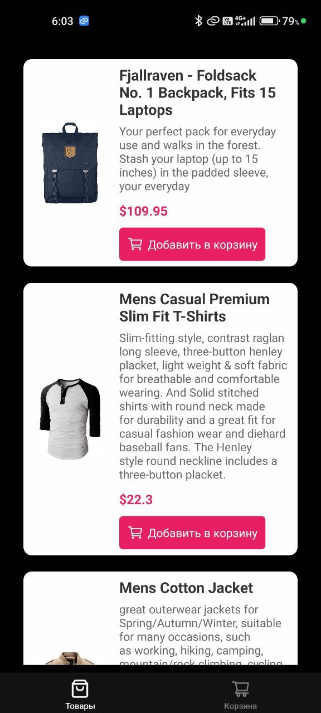
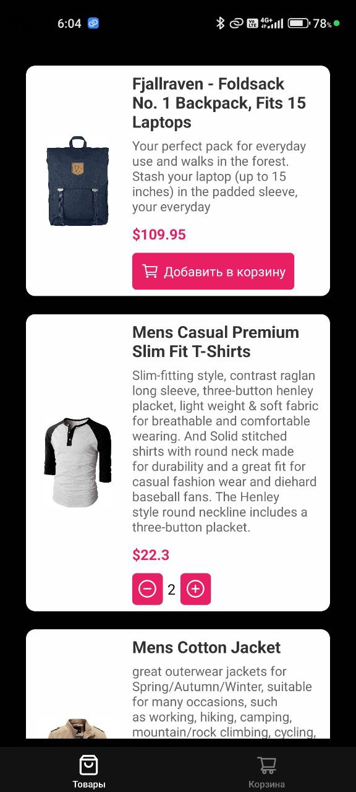
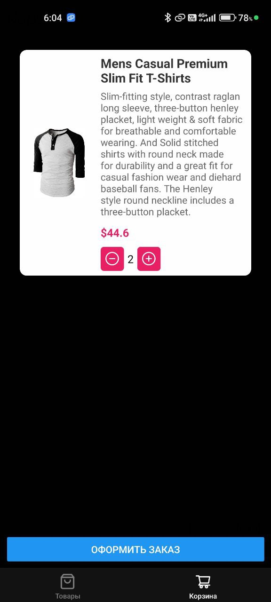
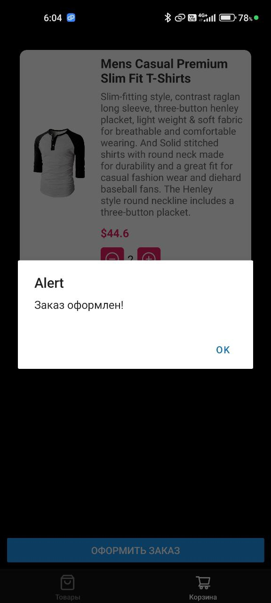

#Приложение для управления товарами и корзиной

Это приложение позволяет пользователям просматривать список товаров, добавлять товары в корзину, увеличивать и уменьшать количество товаров в корзине, а также оформлять заказ. Приложение использует expo-router для навигации и mobx для управления состоянием.

